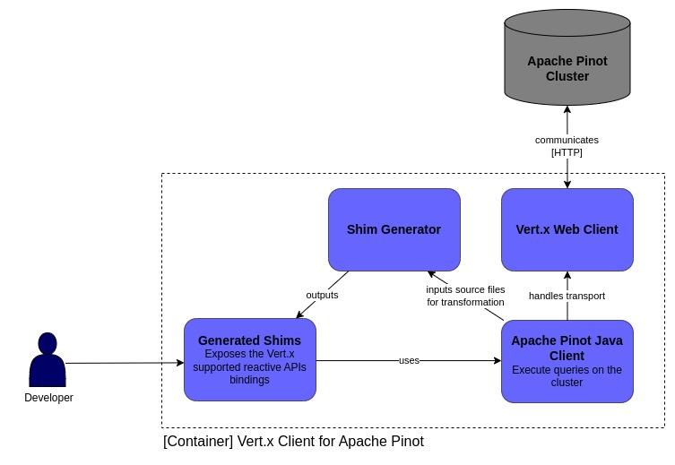

# Eclipse Vert.x client for Apache Pinot

## Personal Information

- **name:** Denis Júlio Martins da Silva
- **email:** djms1234@gmail.com
- **major:** Software Engineering
- **location:** Brazil
- **time zone:** UTC-03:00

## Background

_Eclipse Vert.x_ provides an extremely resource-efficient way to develop reactive applications on the JVM that are both scalable and resilient to failures. This means that Vert.x-based applications can handle more concurrent connections with less hardware than traditional blocking I/O frameworks. This efficiency is particularly important in today's world where there is a growing demand for scalable and responsive applications that can handle large amounts of data without sacrificing performance. Vert.x also enables a declarative programming model that allows developers to describe their desired outcome without having to worry about underlying infrastructure details (e.g., threads).

_Apache Pinot_ is a real-time distributed OLAP datastore that is designed to provide ultra low latency analytics, even at extremely high throughput. Its architecture is optimized for handling large volumes of data with sub-second response times, making it ideal for use cases such as real-time monitoring, anomaly detection, and user facing analytics products. By providing a powerful real-time analytics solution, Pinot helps organizations make data-driven decisions faster and with greater accuracy.

## Value Proposition

This project seeks to develop a reactive client for Apache Pinot enabling users to execute Pinot queries using Vert.x suported APIs such as `Future`, `RxJava`, or `SmallRye Mutiny`.

The creation of a reactive client for Apache Pinot will enable developers to seamlessly integrate Pinot into their Vert.x applications, allowing applications to take advantage of Pinot's ultra-low latency analytics capabilities and efficiently handle large volumes of data in real-time. This may potentially expand the range of use cases for Pinot. It will also provide a valuable addition to the Eclipse Vert.x ecosystem of reactive modules.

## Deliverables

* Develop a Vert.x Client for Apache Pinot
* Write comprehensive unit and integration tests
* Provide clear and comprehensive documentation, including installation instructions, usage guides, and API reference
* Create a sample application that demonstrates the use of the client for executing Pinot queries
* Write a blog post accompanying the sample application, bringing further details to it

## Implementation Plan

### Vert.x Apache Pinot Client

The project will be based on the `Apache Pinot Java Client`, which is a native Java client that makes it easy to execute queries on the cluster.

As inspiration for the project, the approach used by the `Reactiverse Elasticsearch client` could be taken into consideration.
The `Reactiverse Elasticsearch client` is also based on a native Java client that interacts with a datastore. 

The project automatically generate shims, which work as thin wrappers around the methods that perform requests and read responses, exposing the bindings for the Vertx supported APIs.
This is accomplished using libraries like `vertx-codegen`, `javaparser-core`, `vertx-rx-java3-gen`, `vertx-rx-java2-gen` and `vertx-mutiny-generator` that makes a source-to-source transformation from the client source code.

In our case we would implement the shim generation process in its own packages forming a **Shim Generator** module. At build time this module will generate the shims that will expose the reactive APIs for users.

This approach could improve the maintainability of the project since the shims generated are automated and minimal, ensuring compatibility with the underlying native client.

The client transport will be implemented with the Vert.x Web Client leveraging its non-blocking and asynchronous I/O capabilities.

### Tests

The tests will be written using `JUnit Jupiter` and the `Vert.x JUnit 5 integration`, which provides the necessary support for testing asynchronous code. `AssertJ` will also be used to improve readability and expressiveness, and `TestContainers` will be used for integration tests to ensure a consistent environment.

### Documentation

As the `Vert.x Client for Apache Pinot` is being developed, I will write the **Javadocs** to document its structure as it becomes well-established. I expect to have a few parts remaining to document when the project gets finished.

I plan to write content for the Vert.x website's Docs once the client is finished and its APIs usage is defined. This content will cover the installation of the module, its usage, and common questions.

### Sample Application

For my **sample application**, I intend to create a trending products API that identifies the best-selling products based on user behavior and provides recommendations accordingly. However, depending on time constraints and the need for simplicity, I may end up changing the background of the application.

Ultimately, the main focus of this application is to showcase how the `Vert.x Client for Apache Pinot` can be utilized and integrated within a Vert.x application.

### Blog Post

Once I finish the sample application, my next step is to begin writing the **blog post**. The post will examplify how the `Vert.x Client for Apache Pinot` is integrated and used in the **sample application**, I hope this will enable users to quickly jump-start their own projects. My goal is to make the post informative and user-friendly, with clear explanations and step-by-step instructions.

## Timeline 
<!--TODO: Adjust the timeline based on the new Implementation Plan-->

### 4 - 28 May [Community Bonding Period]

During this period, I will focus on getting in touch with the community, introducing myself, and familiarizing myself with the codebase. I will also seek to deepen my understanding of Apache Pinot and its various use cases.

### 29 May - 4 June [1 week]

As someone who values test-driven development, I plan to begin by working on tests in advance, establishing the initial constraints for the project.

### 5 June - 9 July [5 weeks]

During this phase of the project, I will work on the development of the `Vert.x Apache Pinot client`. While implementing it, will also try to define as much in advance as possible, a comprehensive set of tests that it must conform to.

### 10 - 23 July [2 weeks]
 
I will take this time to document the project. I plan to write high-quality Javadocs and create a Vert.x Docs page for the client. My goal is to provide clear and accessible documentation that addresses common pitfalls and questions.

### 24 July - 20 August [4 weeks]

In this final phase of the project, I will write the **sample application** that showcases the newly created **Vert.x Client for Apache Pinot**. I will also write the **blog post** that accompanies the application, providing further examples and explanations of the client's usage. 

## Why me

I am someone who is deeply passionate about software and technology. I also highly value the time and effort that many developers and members of the global open-source community have put into their work - it is truly amazing. My admiration has grown into a desire to contribute and inspire myself.

In terms of my competence, I have been programming since 2019. What started out as a hobby - creating Android Apps - has now become a career choice and a path that I am pursuing. Throughout this time, I have primarily programmed in Java, but I am also well-versed in Kotlin and Javascript. As someone who values simplicity, concision, and declarative code, I see the reactive paradigm as a powerful tool that enables developers to focus on what's important, without having to worry about infrastructure. With that being said, I feel ready to tackle the task at hand.
