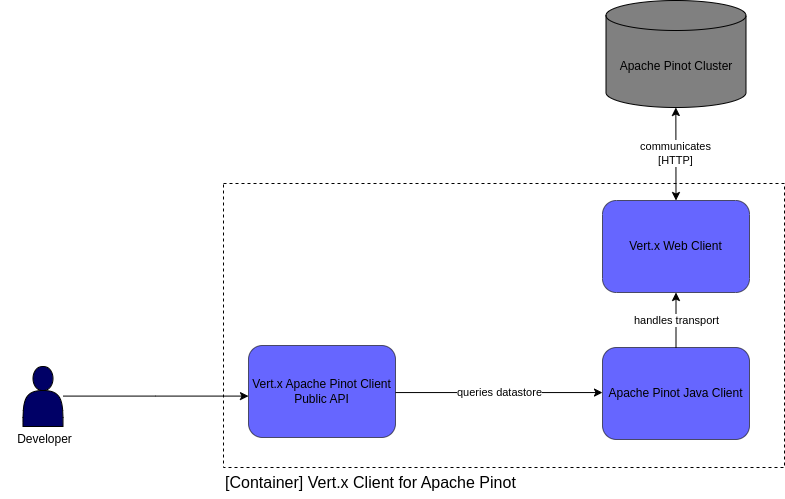

# Eclipse Vert.x client for Apache Pinot

## Personal Information

- **name:** Denis Júlio Martins da Silva
- **email:** djms1234@gmail.com
- **major:** Software Engineering
- **location:** Brazil
- **time zone:** UTC-03:00

## Background
<!-- 
Explain the benefit to the organization and the community as a whole. What would Google and the organization gain from sponsoring this work? What are the cool things that will be demonstrated?
* Make the case for Vert.x
* Make the case for Apache Pinot and its use cases
* Make the case for the project
* Highlight benefits for the Eclipse Vert.x 
* Highlight benefits for the community as a whole
-->

_Eclipse Vert.x_ provides an extremely resource-efficient way to develop reactive applications on the JVM that are both scalable and resilient to failures. This means that Vert.x-based applications can handle more concurrent connections with less hardware than traditional blocking I/O frameworks. This efficiency is particularly important in today's world where there is a growing demand for scalable and responsive applications that can handle large amounts of data without sacrificing performance. Vert.x also enables a declarative programming model that allows developers to describe their desired outcome without having to worry about underlying infrastructure details (e.g., threads).

_Apache Pinot_ is a real-time distributed OLAP datastore that is designed to provide ultra low latency analytics, even at extremely high throughput. Its architecture is optimized for handling large volumes of data with sub-second response times, making it ideal for use cases such as real-time monitoring, anomaly detection, and user facing analysis products. By providing a powerful real-time analytics solution, Pinot helps organizations make data-driven decisions faster and with greater accuracy.

## Value Proposition

This project seeks to develop a reactive client for Apache Pinot enabling users to execute Pinot queries using Vert.x suported APIs such as `Future`, `RxJava`, or `SmallRye Mutiny`.

The creation of a reactive client for Apache Pinot will enable developers to seamlessly integrate Pinot into their Vert.x applications, allowing applications to take advantage of Pinot's ultra-low latency analytics capabilities and efficiently handle large volumes of data in real-time. This may potentially expand the range of use cases for Pinot. It will also provide a valuable addition to the Eclipse Vert.x ecosystem of reactive modules.

## Implementation Plan

The project will be based on the `Apache Pinot Java Client`, which is a native java client that makes it easy to execute queries on the cluster. The Vert.x client for Pinot, will expose a new interface for datastore interaction throught its reactive API. The client transport will be implemented with the Vert.x Web Client leveraging its non-blocking and asynchronous I/O capabilities.

## Deliverables

* Develop a Vert.x Client for Apache Pinot
* Write comprehensive unit and integration tests
* Provide clear and comprehensive documentation, including installation instructions, usage guides, and API reference
* Create a sample application that demonstrates the use of the client for executing Pinot queries
* Write a blog post accompanying the sample application, bringing further details to it

## Timeline

### 4 - 28 May [Community Bonding Period]

During this period, I will focus on getting in touch with the community, introducing myself, and familiarizing myself with the codebase. I will also seek to deepen my understanding of Apache Pinot and its various use cases.

### 29 May - 12 June

As someone who values test-driven development, I plan to begin by working on tests in advance, establishing the initial constraints for the project. As I continue to develop tests, I will also work on creating the Vert.x Web Client as a transport for the Apache Pinot Java Client.

### 13 June - 10 July

During this phase of the project, I will work on the development of the Vert.x Apache Pinot client and the public APIs it will expose. While implementing it, will also try to define as much in advance as possible, a comprehensive set of tests that it must conform to.

### 11 - 24 July
 
As someone who values well-documented software, I will take this time to document the project thoroughly. I plan to write high-quality Javadocs and create a Vert.x Docs page for the client, including installation and usage instructions. My goal is to provide clear and accessible documentation that addresses common pitfalls and questions.

### 25 July - 20 August

In this final phase of the project, I will write an application that showcases the newly created Vert.x Client for Apache Pinot. I will also write a blog post that accompanies the application, providing further examples and explanations of the client's usage. 

## Why me

I am someone who is deeply passionate about software and technology. I also highly value the time and effort that many developers and members of the global open-source community have put into their work - it is truly amazing. My admiration has grown into a desire to contribute and inspire myself.

In terms of my competence, I have been programming since 2019. What started out as a hobby - creating Android Apps - has now become a career choice and a path that I am pursuing. Throughout this time, I have primarily programmed in Java, but I am also well-versed in Kotlin and Javascript. As someone who values simplicity, concision, and declarative code, I see the reactive paradigm as a powerful tool that enables developers to focus on what's important, without having to worry about infrastructure. With that being said, I feel ready to tackle the task at hand.
